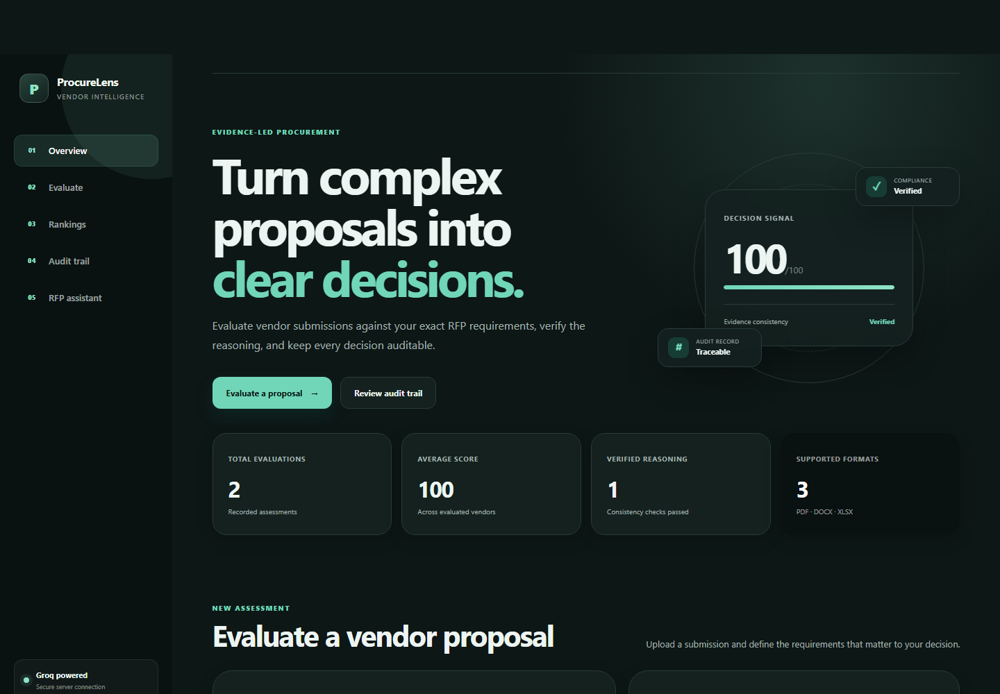
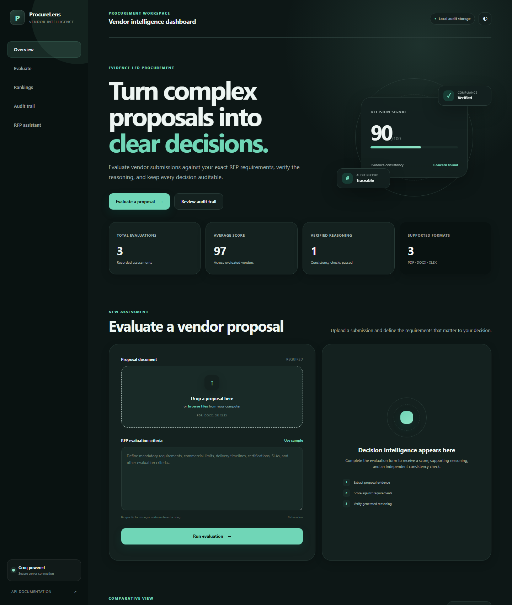

# RFP Vendor Evaluation Agent

[](https://www.python.org/)
[](https://fastapi.tiangolo.com/)
[](https://groq.com/)

An API for evaluating vendor proposals against RFP requirements. It extracts
content from common business-document formats, uses a Groq-hosted language
model to produce evidence-based scores, independently checks the generated
reasoning, ranks vendors, and maintains a local audit trail.

> [!IMPORTANT]
> AI-generated evaluations should support, not replace, procurement review and
> human judgment. Validate scores and cited evidence before making decisions.

## Interface Preview

### Decision dashboard

<p align="center">
  
</p>

### Evaluation workspace

<p align="center">
  
</p>

## Features

- Extracts proposal text from PDF, DOCX, and XLSX files
- Scores proposals from 0 to 100 against user-provided RFP criteria
- Instructs the model to rely on proposal evidence and apply numeric limits literally
- Performs a second model pass to check whether scoring reasoning is supported
- Ranks validated vendor-score objects from highest to lowest
- Answers questions using only supplied RFP text
- Writes SHA-256 proposal and criteria fingerprints to a JSONL audit trail
- Includes a responsive web dashboard with light and dark themes
- Provides interactive OpenAPI documentation through FastAPI Swagger UI
- Treats uploaded document text as untrusted content to reduce prompt-injection risk

## How It Works

```text
Vendor document
      |
      v
Text extraction (PDF/DOCX/XLSX)
      |
      v
Groq evaluation against RFP criteria
      |
      v
Independent consistency check
      |
      v
JSONL audit record + API response
```

The uploaded file is written to a temporary location for extraction and then
deleted. The full extracted proposal is not stored in the audit log; a SHA-256
fingerprint is stored instead. The RFP criteria, score, model-generated
reasoning, and consistency result are retained. Because reasoning can summarize
proposal evidence, review the audit log's storage location and access controls.

## Technology

| Component | Purpose |
| --- | --- |
| FastAPI | HTTP API and interactive documentation |
| Groq SDK | Hosted inference, structured JSON responses, and safe API errors |
| pdfplumber | PDF text extraction |
| python-docx | Word document extraction |
| openpyxl | Excel workbook extraction |
| python-dotenv | Local environment configuration |

## Requirements

- Python 3.10 or newer
- A Groq API key
- Internet access for Groq API requests

## Web Dashboard

The built-in interface requires no separate frontend server or build step. It
provides streamlined sidebar navigation, proposal upload, criteria entry,
evaluation results, vendor rankings, audit filtering, grounded RFP question
answering, and a persistent theme preference. All requests are sent to the
FastAPI backend on the same origin.

## API Reference

| Method | Endpoint | Description |
| --- | --- | --- |
| `POST` | `/score-vendor` | Upload and evaluate one vendor proposal |
| `POST` | `/rank-vendors` | Sort validated vendor scores in descending order |
| `POST` | `/chat` | Ask a question using supplied RFP text |
| `GET` | `/audit-trail` | Retrieve all audit records or filter by vendor name |

### Score a vendor

Send a multipart request containing:

- `file`: a `.pdf`, `.docx`, or `.xlsx` proposal
- `rfp_criteria`: the requirements used for evaluation

```bash
curl -X POST "http://127.0.0.1:8000/score-vendor" \
  -F "file=@sample_vendor_proposal.pdf" \
  -F "rfp_criteria=Complete migration within 16 weeks; maintain PCI-DSS compliance; provide 24/7 support; guarantee 99.9% uptime; keep first-year cost below 200000 dollars."
```

Example response:

```json
{
  "audit_id": "7dc3029c-65ef-47e1-b517-0e63a3ab3a21",
  "vendor_name": "sample_vendor_proposal.pdf",
  "timestamp": "2026-07-15T18:30:00+00:00",
  "score": 92,
  "reasoning": "The proposal satisfies the stated timeline, compliance, support, uptime, and cost requirements.",
  "rfp_criteria": "Complete migration within 16 weeks...",
  "vendor_text_sha256": "...",
  "rfp_criteria_sha256": "...",
  "consistent": true,
  "concern": "",
  "consistency_error": ""
}
```

Scores and wording vary by model output. A completed score can still be
returned when the independent consistency check fails; in that case,
`consistent` is `null` and `consistency_error` explains the failure.

### Rank vendors

```bash
curl -X POST "http://127.0.0.1:8000/rank-vendors" \
  -H "Content-Type: application/json" \
  -d '[
    {"name":"Vendor A","score":92,"reasoning":"Strong compliance"},
    {"name":"Vendor B","score":78,"reasoning":"Several gaps"}
  ]'
```

### Ask about RFP text

```bash
curl -X POST "http://127.0.0.1:8000/chat" \
  -F "question=What is the required implementation timeline?" \
  -F "rfp_text=The selected vendor must complete implementation within 16 weeks."
```

The endpoint answers only from the provided `rfp_text` and states when an
answer is unavailable.

### Retrieve the audit trail

Retrieve all records:

```bash
curl "http://127.0.0.1:8000/audit-trail"
```

Filter by exact uploaded filename:

```bash
curl "http://127.0.0.1:8000/audit-trail?vendor_name=sample_vendor_proposal.pdf"
```

## Project Structure

```text
.
|-- main.py                        # FastAPI routes and request handling
|-- groq_client.py                 # Groq client, JSON parsing, and API errors
|-- reader.py                      # PDF, DOCX, and XLSX text extraction
|-- scoring.py                     # Evidence-based vendor scoring
|-- audit.py                       # Consistency checks and JSONL audit records
|-- ranking.py                     # Vendor validation and ranking
|-- chatbot.py                     # Grounded answers and JSON-shape normalization
|-- docs/images/                   # Dashboard screenshots for documentation
|-- static/
|   |-- index.html                 # Dashboard structure and content
|   |-- styles.css                 # Responsive visual system and themes
|   |-- app.js                     # API integration and UI state
|   `-- favicon.svg                # Application icon
|-- requirements.txt               # Python dependencies
|-- sample_vendor_proposal.pdf     # Example document for local testing
`-- .gitignore                     # Local secrets and generated artifacts
```

## Security and Privacy

- Never commit `.env` or place API keys in source code.
- Rotate any credential that has been pasted into chat, logs, commits, or issues.
- Uploaded proposal and RFP content is sent to Groq for processing.
- Review your organization's data-handling requirements before submitting
  confidential procurement material to an external model provider.
- The API currently has no authentication, authorization, rate limiting, or
  upload-size limit. Add these controls before exposing it to untrusted users.
- The default audit log is a local JSONL file intended for a single application
  instance, not a multi-node production deployment.

## Development Checks

Run a source-level syntax check:

```bash
python -m compileall .
```

Check installed dependency compatibility:

```bash
pip check
```

For end-to-end testing, start the application and use the dashboard at `/`.
Use `/docs` for direct interactive endpoint testing.

## Contributing

Issues and pull requests are welcome. Keep changes focused, avoid committing
credentials or generated audit data, and verify the API locally before opening
a pull request.
